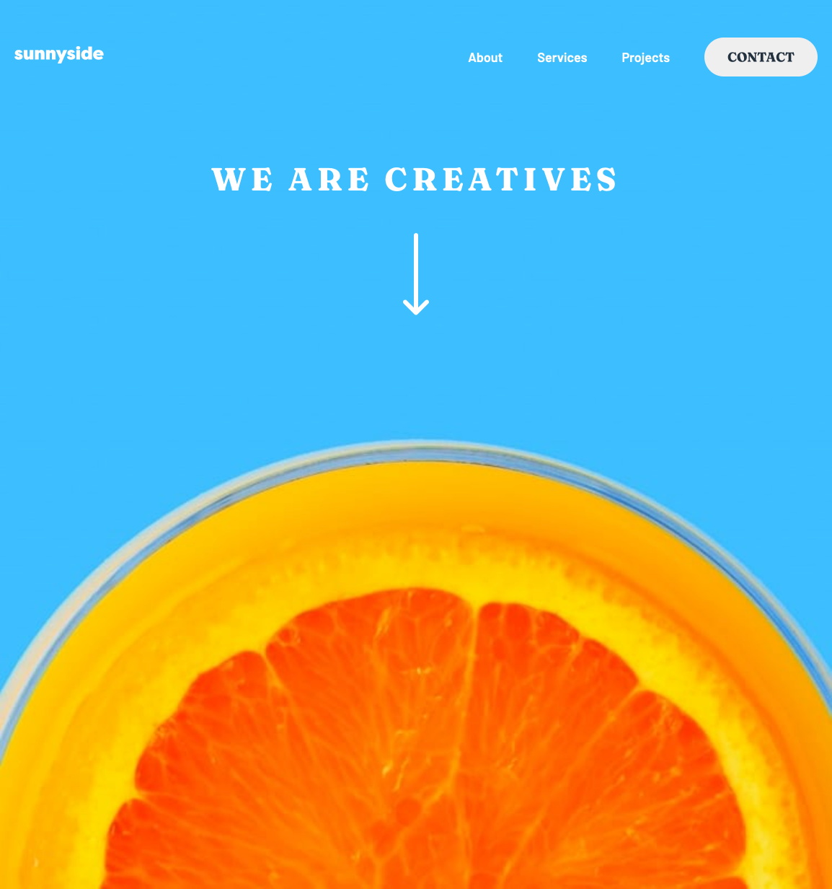

# Frontend Mentor - Sunnyside agency landing page solution

This is a solution to the [Sunnyside agency landing page challenge on Frontend Mentor](https://www.frontendmentor.io/challenges/sunnyside-agency-landing-page-7yVs3B6ef). Frontend Mentor challenges help you improve your coding skills by building realistic projects.

## Table of contents

- [Overview](#overview)
  - [The challenge](#the-challenge)
  - [Screenshot](#screenshot)
  - [Links](#links)
- [Author](#author)

**Note: Delete this note and update the table of contents based on what sections you keep.**

## Overview

### The challenge

Users should be able to:

- View the optimal layout for the site depending on their device's screen size
- See hover states for all interactive elements on the page

### Screenshot

### Links

- Solution URL: [Solution](https://github.com/moyanich/sunnyside-agency-landing-page)
- Live Site URL: [Live site](https://moyanich.github.io/sunnyside-agency-landing-page/)

## My process

### Built with

- Semantic HTML5 markup
- SCSS
- CSS custom properties
- Flexbox
- CSS Grid
- Desktop-first workflow

## Author
- Github - [Github Profile](https://github.com/moyanich/)
- Website - [Portfolio](http://amoycreative.com/)
- Frontend Mentor - [@ymoyanich](https://www.frontendmentor.io/profile/moyanich)
- Twitter - [@moyapixel](https://www.twitter.com/moyapixel)
